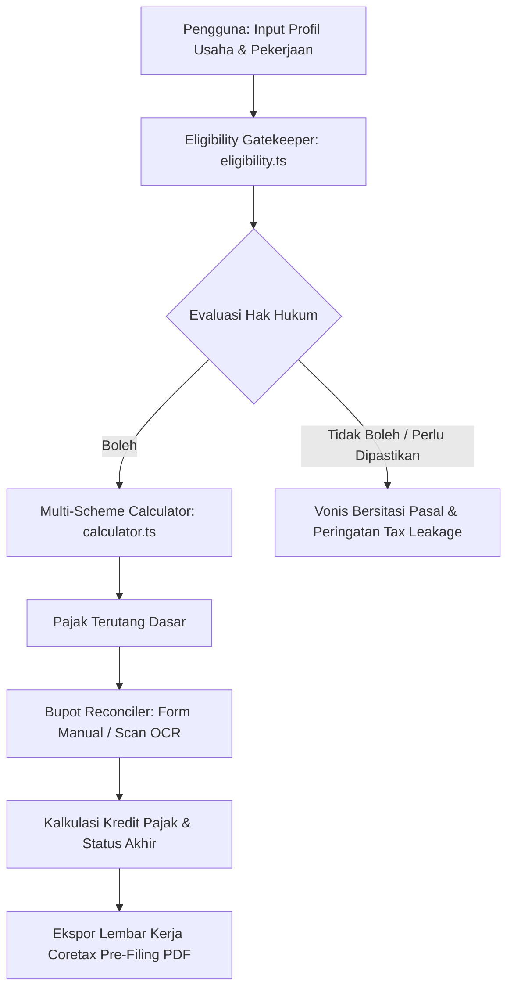

# PajakWajar · ITechno Cup 2026

> **"Ketahui skema pajak yang secara hukum boleh Anda pakai sebelum menghitung angka."**

PajakWajar adalah platform simulasi pra-lapor perpajakan deterministik berbasis web yang menempatkan **uji kelayakan hukum di hulu** sebelum melakukan penghitungan pajak. Dirancang khusus bagi pekerja mandiri (*freelancer*), kreator konten, dokter, konsultan, dan pelaku usaha mikro di Indonesia.

---

## 📌 Latar Belakang & Masalah

Pada 5 Juni 2026, Direktorat Jenderal Pajak (DJP) mempertegas bahwa pekerja mandiri dan kreator konten yang mengandalkan keahlian pribadi **tidak diperbolehkan menggunakan PPh Final UMKM 0,5%** (sesuai amanat **PP No. 20 Tahun 2026**).

Mayoritas kalkulator pajak yang beredar langsung menghitung angka dan mengasumsikan pengguna sudah mengetahui haknya. Kesalahan pemilihan skema di awal berisiko menimbulkan Surat Tagihan Pajak (STP) dan sanksi denda administrasi dari DJP. PajakWajar memecahkan masalah ini dengan alur:

$$\text{KELAYAKAN HUKUM} \longrightarrow \text{PERHITUNGAN} \longrightarrow \text{KONSEKUENSI} \longrightarrow \text{BERKAS PRA-LAPOR}$$

---

## 🎯 Kesesuaian Tema & Kontribusi SDG (Sustainable Development Goals)

* **SDG 8: Pekerjaan Layak dan Pertumbuhan Ekonomi (Target 8.3)**  
  Melindungi pekerja bebas (*gig economy*), kreator konten, dan usaha mikro dari sanksi denda administrasi perpajakan yang merugikan stabilitas ekonomi usaha mandiri mereka.
* **SDG 9: Industri, Inovasi, dan Infrastruktur (Target 9.b)**  
  Menyediakan infrastruktur digital berupa mesin audit kepatuhan hukum perpajakan berbasis web yang deterministik, transparan, dan dapat diakses secara merata tanpa biaya.

---

## ✨ Fitur Utama & Keunggulan Pembeda

1. **Eligibility Gatekeeper (Uji Kelayakan di Hulu)**  
   Memeriksa hak hukum wajib pajak terhadap skema **PPh Final UMKM 0,5% (PP 20/2026)**, **Norma NPPN (PER-17/PJ/2015)**, dan **Tarif Umum Pembukuan (Pasal 17 UU PPh)** dengan prinsip *Pintu Satu Arah* dan ambang konsolidasi keluarga.
2. **Vonis Deterministik Bersitasi Hukum**  
   Setiap hasil vonis (`BOLEH DIPAKAI`, `TIDAK BOLEH`, `PERLU DICEK DULU`) disertai alasan hukum gamblang dan tautan rujukan pasal regulasi resmi DJP/Kemenkeu.
3. **Bupot Reconciler (Manual & Scan OCR AI)**  
   Merekonsiliasi bukti potong PPh 21 / PPh 23 dari pemberi kerja/klien. Menghitung pemotongan pajak terutang dan menangani status **Kurang Bayar (PPh 29)**, **Nihil**, serta **Lebih Bayar (PPh 28A)** secara tepat tanpa angka minus.
4. **Coretax Pre-Filing Work Sheet (Ekspor PDF)**  
   Mengompilasi seluruh ringkasan profil, vonis kelayakan, rincian hitungan, dan daftar kredit bupot menjadi dokumen lembar kerja A4 resmi siap bawa saat melapor di portal Coretax DJP.

---

## 🏗️ Diagram Alur & Arsitektur Sistem



---

## 💻 Teknologi yang Digunakan & Peruntukannya

Sesuai dengan ketentuan transparansi teknologi kompetisi:

| Teknologi | Peruntukan & Alasan Pemilihan |
|---|---|
| **Next.js 15 (App Router)** | Seluruh komputasi pajak dijalankan di sisi klien (*client-side*) untuk menjamin privasi data finansial. Route Handler server-side digunakan khusus untuk relay aman API OCR tanpa mengekspos kunci API ke browser. |
| **TypeScript** | Menjamin ketatnya kontrak tipe data (`types/pajak.ts`) antara *rule engine*, antarmuka, modul OCR, dan PDF generator. |
| **Tailwind CSS** | Menyediakan tata letak desain yang responsif, modern, dan aksesibel sesuai standar aksesibilitas WCAG. |
| **@react-pdf/renderer** | Menghasilkan dokumen lembar kerja pra-lapor A4 berstruktur formal secara instan di peramban pengguna. |
| **Vitest** | Kerangka pengujian unit otomatis untuk memverifikasi logika aturan hukum pajak dan formula tarif progresif. |
| **Google Gemini API (Vision)** | Membantu ekstraksi teks bukti potong secara cepat melalui relay serverless dengan persetujuan eksplisit pengguna (foto tidak disimpan di server aplikasi). |

---

## 🚀 Panduan Instalasi & Menjalankan Lokal

### Prasyarat
* Node.js v18.18.0 atau yang lebih baru
* npm v9 atau yang lebih baru

### Langkah Instalasi
1. **Clone repositori:**
   ```bash
   git clone https://github.com/AkuSukaProject/Pajak-Wajar.git
   cd Pajak-Wajar
   ```

2. **Instal dependensi:**
   ```bash
   npm install
   ```

3. **Konfigurasi Environment (Opsional untuk fitur OCR):**
   Salin berkas `.env.example` ke `.env.local`:
   ```bash
   cp .env.example .env.local
   ```
   *Isi `GEMINI_API_KEY` jika ingin menguji fitur scan OCR AI. Jika dikosongkan, fitur input manual tetap berfungsi 100%.*

4. **Jalankan server pengembangan:**
   ```bash
   npm run dev
   ```
   Buka peramban di `http://localhost:3000`.

5. **Menjalankan Pengujian Otomatis:**
   ```bash
   npm test
   ```

---

## 🌐 Tautan Live Demo & Repositori

* **Live Demo Web:** [https://pajak-wajar.vercel.app](https://pajak-wajar.vercel.app) *(atau jalankan lokal di port 3000)*
* **Repositori Resmi:** [https://github.com/AkuSukaProject/Pajak-Wajar](https://github.com/AkuSukaProject/Pajak-Wajar)

---

## 📸 Tangkapan Layar Aplikasi (*Screenshots*)

Sesuai panduan ITechno Cup 2026, berikut visualisasi 3 fitur utama antarmuka sistem:

| 1. Kartu Vonis & Sitasi Regulasi | 2. Panel Rekonsiliasi & Bupot | 3. Lembar Kerja Coretax (PDF A4) |
| :---: | :---: | :---: |
|  |  |  |
| *Vonis tegas bersitasi pasal resmi DJP & PP 20/2026.* | *Agregasi kredit pajak bupot PPh 21/23 (Manual & OCR).* | *Ekspor dokumen resmi siap pakai di portal Coretax.* |

---

## 🔒 Privasi, Keamanan & *Security Best Practices*

1. **Client-Side First:** Data profil, nominal omzet, dan rincian penghitungan pajak diproses di dalam browser pengguna dan tidak pernah dikirim ke database mana pun.
2. **Transparansi & Persetujuan OCR:** Foto bukti potong hanya dikirim ke layanan OCR setelah pengguna memberikan persetujuan eksplisit. Berkas hanya diproses di memori dan **tidak pernah disimpan ke disk/server**.
3. **Validasi Server Berlapis (Magic Bytes & MIME):** Route handler memvalidasi file signature / *magic bytes* (JPEG, PNG, WebP, PDF) untuk mencegah serangan *file extension spoofing* dan *malicious upload*.
4. **Proteksi Kuota & In-Memory Bounded Rate Limiting:** Endpoint OCR dilindungi mekanisme *rate limiter* berbasis IP dengan batas memori maksimum (*bounded memory map*) untuk mencegah ancaman kebocoran memori (memory exhaustion DoS).
5. **Ketatnya Validasi Skema AI (Zod Schema):** Output AI divalidasi ketat tanpa *silent fallback* ke nilai palsu. Jika data buram atau meragukan, sistem menandai peringatan `⚠️ Perlu Pemeriksaan Manual` bagi pengguna.

---

## 🤖 Pernyataan Transparansi Penggunaan AI

Sesuai Ketentuan Peserta ITechno Cup 2026 poin 7:
* **Bagian yang Menggunakan AI:** AI (Google Gemini Vision API) digunakan sebagai asisten pembacaan dokumen fisik bukti potong (*OCR extractor*) dan asisten *scaffolding* kode awal.
* **Tanggung Jawab Tim:** Seluruh logika penentuan hak hukum perpajakan, pasal regulasi, serta formula kalkulator tarif progresif dibangun secara **deterministik (rule-based)** dan diverifikasi manual oleh tim pengembang berdasarkan naskah resmi undang-undang perpajakan Republik Indonesia (PP 20/2026, UU HPP No. 7/2021, PER-17/PJ/2015).

---

## ⚖️ Penafian Hukum (*Legal Disclaimer*)

PajakWajar adalah alat bantu simulasi edukasi pra-lapor mandiri. Hasil perhitungan bukan merupakan nasihat pajak resmi dan tidak menggantikan konsultasi dengan Direktorat Jenderal Pajak (DJP) atau konsultan pajak berizin. Selalu verifikasi seluruh angka melalui akun resmi Coretax Anda sebelum menyampaikan SPT Tahunan.

---

**Tim Pengembang PajakWajar · ITechno Cup 2026**
